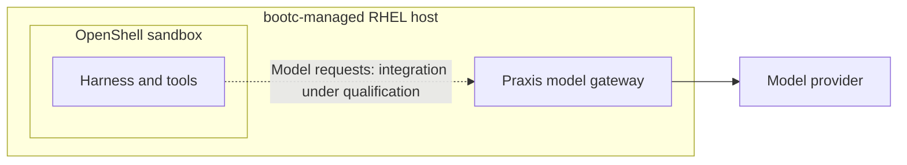

# Secure single-server AI gateway

Give people access to approved AI coding models on one administrator-managed
RHEL server without handing out provider credentials. The goal is to control
shared inference usage, protect the server and workspaces, and make the setup
repeatable as more harnesses and model providers are added.

The starting workflow is a user logging into RHEL and running Claude Code,
Codex or OpenCode through Praxis. OpenShell extends that model with sandboxed
execution and, as a qualification target, retained work that collaborators can
reconnect to. bootc packages the host setup into a reviewed OS image.

| Component | What it adds to a harness |
| --- | --- |
| **OpenShell** | A sandbox with declarative filesystem and network policies, separating agent tools from the host environment. |
| **Praxis** | A model gateway that holds provider credentials and applies shared request and token limits. |
| **bootc** | A bootable OS image containing the service setup and selected harness configuration, with image-based updates and OS rollback. |

The intended combined model path is:

OpenShell governs the harness's execution environment. Praxis governs model
requests routed through it. bootc packages their host setup so each machine
starts from the same reviewed deployment. These are complementary controls;
OS rollback does not roll back sandbox workspaces or application data.

The [scope and roadmap](docs/roadmap.md) connects these building blocks to the
phased goals: durable quotas, model routing, guardrails, private inference,
individual access controls, retained work and usage visibility.

## Start here

| Goal | Guide |
| --- | --- |
| Build a bootable host with one selected harness | [RHEL 9 bootc images](bootc/README.md) |
| Explore Codex, OpenCode or OpenClaw in a sandbox | [OpenShell recipes](openshell/docs/README.md) |
| Connect a sandboxed harness to Praxis | [Combined integration and current status](docs/quickstarts/openshell-praxis/README.md) |
| Use Praxis with harnesses running directly on a shared RHEL host | [All-in-one gateway](docs/quickstarts/all-in-one/README.md) |
| Use Praxis from harnesses on other machines | [Remote HTTPS/JWT gateway](docs/quickstarts/remote-gateway/README.md) |
| Develop or validate a change | [Testing guide](docs/testing/README.md) |

The bootc path builds a shared base and one image each for **Codex, OpenCode and
OpenClaw**. Pinned workload containers are pulled on first boot and cached across
reboots, keeping them out of the OS layers. Credentials and machine state are
provisioned separately. The current bootc target is RHEL 9 x86_64.

## What works today

This is an experimental deployment and validation repository. AWS RHEL testing
has built all four bootc images, booted Codex and OpenCode, exercised OS upgrades,
a harness switch and rollback, and checked rootless services, SELinux, loopback
listeners and sandbox CLI execution. See the [validation record](bootc/VALIDATION.md).

The complete **sandbox → Praxis → provider** path is still under qualification:
OpenCode has experimental configuration support; Codex and OpenClaw reject Praxis
configuration. Host routing, real-provider inference and tool tasks remain gaps.
Use the [integration matrix](docs/quickstarts/openshell-praxis/users.md) for details.

OpenShell currently assumes a trusted single operator; local management is not a
multi-tenant authorization boundary. Praxis quotas are shared, not per-user or
USD budgets. The bootc profile uses in-memory quotas; the mutable Praxis deployment
offers Valkey for persistent token usage. Durable quotas are a baseline target;
the bootc memory profile is a development step toward it. Read the
[OpenShell trust model](openshell/docs/threat-model.md) and
[quota semantics](docs/quickstarts/common/token-quotas.md) before granting access.

## Upstream projects

This repository supplies deployment configuration, lifecycle scripts and tests.
It consumes [Praxis experimental](https://github.com/praxis-proxy/experimental)
and [OpenShell](https://github.com/opendatahub-io/openshell) images; it does not
implement either runtime or the harnesses themselves.
