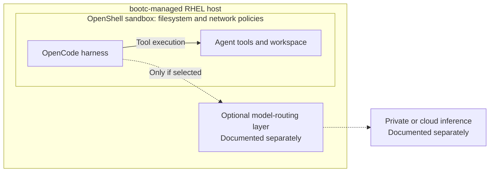

# Secure single-server AI harness with OpenShell

AI coding harnesses such as **OpenCode** and **OpenClaw** become useful when
they can read a workspace, run tools, and call a model. Those are also the
powers that make them risky to operate on a shared server: tools can touch
unrelated data, commands can open unintended network connections, and an
interactive harness can inherit far more host access than its task needs.

This repository packages those harnesses with **OpenShell** on one
administrator-managed RHEL server or bare-metal host. The harness keeps the
developer experience. OpenShell is the security boundary: it applies declared
filesystem and network policies, runs tools through rootless Podman under a
locked service account, and gives each sandbox CPU and memory ceilings. The
server can remain available remotely without giving the harness an unrestricted
host login.

Start with the
[OpenShell single-server guide](docs/quickstarts/openshell-single-server/README.md).
It explains the value, applies the policy manually or through the project's
existing bootc image, and provides repeatable harness tests.

For the complete layered architecture, including model routing and private
inference, continue to the
[architecture value walkthrough](docs/quickstarts/architecture-walkthrough/README.md).

## Why OpenShell earns the security role

OpenShell turns agent execution into an explicit policy decision:

- **Filesystem blast radius:** declared system paths are read-only while
  sandbox and workspace paths can be writable.
- **Network blast radius:** endpoints are allowlisted per harness or tool
  binary; unapproved destinations are denied.
- **Least-privilege runtime:** the gateway and sandbox use a locked account,
  rootless Podman, and default per-sandbox limits of two CPUs, 4 GiB RAM, and
  2048 PIDs.
- **Always-on operation:** lingering services keep the sandbox host available
  after SSH disconnect, while management remains loopback-only.
- **Auditable decisions:** logs and qualification scripts distinguish an actual
  policy denial from an unrelated timeout or DNS failure.
- **Repeatable deployment:** digest-pinned control-plane and harness image
  references are packaged into one bootc host deployment with rollback.

OpenShell is not a claim that generated code is safe. It is a containment and
policy layer for the harness and tools executing that code. The current
deployment is a trusted single-operator design, not multi-tenant authorization;
see the [trust model](openshell/docs/threat-model.md).

## Start for your role

| Role | Start here | Outcome |
| --- | --- | --- |
| Sys admin | [OpenShell single-server guide](docs/quickstarts/openshell-single-server/README.md) | Deploy manually or apply the existing bootc image, verify policy, and test a harness. |
| Solution architect | [Threat model](openshell/docs/threat-model.md) and [policy contract](openshell/docs/policy-walkthrough.md) | Understand the controls, enforcement evidence, and limits before approving a topology. |
| Potential customer | [Bootc quickstart](docs/quickstarts/openshell-single-server/README.md#bootc-quickstart) | Evaluate OpenCode or OpenClaw on a disposable RHEL host using the published image. |
| OpenShell + Praxis operator | [Integration guide](docs/quickstarts/openshell-praxis/README.md) | Use the existing model-routing and quota workflow without losing this repository's detail. |

## How the pieces fit

| Component | Responsibility |
| --- | --- |
| **Harnesses** | Provide the coding-agent experience: prompts, model interactions, and tool calls. Recipes cover several harnesses; supported integrations differ. |
| **OpenShell** | Runs the harness and tools inside a sandbox with declarative filesystem, network, runtime, and service-account boundaries. |
| **Praxis** | Optional model-routing layer; see the [integration guide](docs/quickstarts/openshell-praxis/README.md). |
| **Inference backend** | Optional private vLLM or cloud provider selected through the existing model-routing documentation. |
| **bootc** | Packages the reviewed OpenShell setup and selected harness into an updatable RHEL OS image with rollback. |

Tools execute within OpenShell's policies. Model routing, when selected, is a
separate path documented in the architecture walkthrough:

```mermaid
flowchart LR
    subgraph Host["bootc-managed RHEL host"]
        subgraph Sandbox["OpenShell sandbox: filesystem and network policies"]
            H["OpenCode harness"]
            T["Agent tools and workspace"]
            H -->|Tool execution| T
        end
        P["Optional model-routing layer<br/>Documented separately"]
        H -.->|Only if selected| P
    end
    V["Private or cloud inference<br/>Documented separately"]
    P -.-> V
```

That optional integration preserves the important boundary: the harness still
executes tools inside OpenShell rather than with an unrestricted host login.

Pinned workload containers are pulled on first boot and cached across reboots.
Credentials, model caches, and workspace data stay outside the OS image.
OS rollback restores the host deployment; it does not restore application data
or sandbox workspaces.

## Choose a deployment

| Workflow | Where the harness and tools run | Guide |
| --- | --- | --- |
| Manual OpenShell single server | OpenShell and the selected harness on a RHEL VM or bare-metal host | [Manual deployment](docs/quickstarts/openshell-single-server/README.md#manual-rhel-deployment) |
| Fast OpenShell single server | Existing bootc image applied to a RHEL single server or bare-metal host | [Bootc quickstart](docs/quickstarts/openshell-single-server/README.md#bootc-quickstart) |
| RHEL with Qwen and optional cloud providers | Ordinary user accounts on all-in-one, or remote clients; CPU/GPU selected independently | [Install Qwen inference](docs/quickstarts/common/vllm.md), then [add providers](docs/quickstarts/common/providers.md) |
| Sandboxed agents with separate inference | OpenShell on a bootc-managed server; Praxis routes to a private CPU or NVIDIA L4 vLLM server | [Qwen3-8B example](bootc/VLLM.md) |
| Sandboxed harness exploration | OpenShell on the server, with harness-specific policies and provider setup | [OpenShell recipes](openshell/docs/README.md) |
| Shared host with a cloud gateway | Harnesses run directly under OS accounts on RHEL; Praxis owns provider credentials | [All-in-one gateway](docs/quickstarts/all-in-one/README.md) |
| Remote clients with a central gateway | Harnesses and tools stay on client machines; requests reach Praxis over HTTPS with caller JWTs | [Remote gateway](docs/quickstarts/remote-gateway/README.md) |

For OS image creation, start with the [RHEL 9 bootc guide](bootc/README.md).
The current target is x86_64, with a shared base and separate **Codex, OpenCode,
and OpenClaw** OS variants. A harness image being available does not mean every
Praxis/backend combination is supported; consult the
[integration matrix](docs/testing/compatibility.md) and the local
example's validation report.

## Validated today

This is an experimental deployment and validation repository. The strongest
recorded end-to-end example is **OpenCode → Praxis → vLLM** on bootc. AWS tests with
OpenShell `0.1.2-rhaiv.0` passed on CPU and NVIDIA L4, covering real Qwen3-8B
inference, streamed responses, independently verified tool execution, explicit
bypass denials, cached reboot, and disable/re-enable behavior. The
[local inference report](bootc/VLLM-VALIDATION.md) records exact pins and limits,
including the GPU instance's cleanup issue.

The preferred topology now places vLLM on a separate server and keeps only
OpenShell, Praxis, and the harness on the single server. The AWS helper discovers
that server's private address and grants access by security group; its fresh
real-inference qualification remains separate work.

The manual and published bootc OpenShell-only single-server paths were verified
on AWS on 2026-10-02. Both published Quay variants passed controlled policy
testing, runtime-limit inspection, SELinux, lingering, and loopback-only
listener checks from their exact recorded digests. See the
[single-server validation note](docs/quickstarts/openshell-single-server/README.md#aws-verification);
model routing is not active during that OpenShell qualification.

The mutable AWS workflow also passed native mocked Qwen/OpenAI/Anthropic
tests. With vLLM 0.30, all-in-one real Qwen tasks passed for Codex, Claude and
OpenCode on both CPU and GPU with the current Praxis image.
See the [compatibility matrix](docs/testing/compatibility.md) for exact pins,
remote-gateway baselines, protocol limits and separate OpenShell results.

Earlier AWS testing also exercised bootc builds, Codex/OpenCode boot and CLI
execution, OS upgrades, a harness switch, and rollback. See the
[host validation record](bootc/VALIDATION.md). The separate sandbox-to-Praxis
cloud-provider path remains under qualification; Codex and OpenClaw reject
Praxis configuration.

The current trust and usage boundaries are explicit:

- OpenShell assumes a trusted single operator. Local management is not a
  multi-tenant authorization boundary.
- Praxis quotas are shared token allowances, not per-user limits or USD budgets.
  bootc uses in-memory quotas; the mutable Praxis deployment offers Valkey for
  persistent token usage.
- CPU inference is functional but slow on the tested eight-vCPU host. Additional
  hardware, sustained load, and coding quality are not qualified by the smoke tests.

See the [OpenShell trust model](openshell/docs/threat-model.md) and
[quota semantics](docs/quickstarts/common/token-quotas.md) for the control boundaries.

## Where this is going

The broader goal is an environment where people can run useful agent tasks
with approved models, controlled workspaces, predictable shared usage, and
repeatable operations. Local inference now provides a tested foundation for
that work. Durable bootc quotas, routing and failover, inference guardrails,
individual and team authorization, retained collaborative sessions, and usage
visibility remain planned or partially implemented capabilities.

The [scope and roadmap](docs/roadmap.md) separates those goals from current
acceptance. To contribute or validate a new combination, use the
[testing guide](docs/testing/README.md).

## Upstream projects

This repository supplies deployment configuration, lifecycle scripts, harness
recipes, and acceptance tests. It consumes [Praxis experimental](https://github.com/praxis-proxy/experimental),
[OpenShell](https://github.com/NVIDIA/OpenShell), and
[vLLM](https://github.com/vllm-project/vllm); it does not implement those runtimes
or the harnesses themselves. The older [Praxis Ruby framework](https://github.com/praxis/praxis)
is a separate project and is not the gateway used here.
