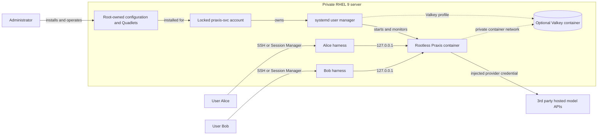

# All-in-one RHEL AI gateway

One administrator-managed Praxis gateway serves users who have separate
accounts on the same private RHEL 9 server. Users can use the configured
model providers, but cannot read provider credentials or change gateway
policy.

## Architecture

`praxis-svc` is a non-login service account used only to own and run the
Praxis containers. Its systemd user manager remains active across logouts and
reboots. Users cannot sign in as this account.

## Trust model

| Boundary | Decision |
| --- | --- |
| Remote entry | SSH or AWS Systems Manager Session Manager |
| User identity | One OS account per user; no shared `ssm-user` account |
| Praxis access | Any admitted server user may call the loopback inference ports |
| Caller JWT | Not required by the default profiles |
| Limits | Shared globally by every caller of each protocol chain |
| Service owner | Dedicated non-login `praxis-svc` account |
| Provider credentials | Podman secrets available only inside the Praxis container |
| Configuration | Root-owned and unavailable for modification by users |
| Admin and Valkey ports | Not published to the host |

This design trusts admitted accounts to share one service and one set of
allowances. It does not prevent one user from consuming the global
allowance. Root and the server administrator remain trusted.

Praxis cannot determine the originating OS user from a loopback TCP request.
A validated caller JWT could supply a Praxis identity, but the limiters still
need subject-keyed state before that identity can receive an individual limit.

## Administrator setup

Choose one mutually exclusive profile. Use Valkey for persistent daily token
quotas; memory and Switchyard profiles are development/evaluation paths.

| Profile | Host ports | State after Praxis restart | Quickstart |
| --- | --- | --- | --- |
| In-memory | `127.0.0.1:8080`, `:8081` | Request-rate protection and token quotas reset | [Install](in-memory.md) |
| Valkey | `127.0.0.1:8080`, `:8081` | Token usage survives; request limits reset | [Install](valkey.md) |
| Switchyard | baseline plus `127.0.0.1:8082` | Limits and routing decisions reset | [Install](switchyard.md) |

Use the selected quickstart from a reviewed checkout on the administrator's
workstation. It transfers only the required deployment bundle into the
administrator's private RHEL staging directory. The scripts prepare the locked
account, create versioned Podman secrets, install the profile, and run the host
verification. Ordinary users never receive the bundle. Changing profiles
requires uninstalling the current profile first.

## User workflow

Each user signs in with a separate OS account and runs Claude Code, Codex,
or OpenCode on the RHEL server. The harness sends a non-secret placeholder to
a loopback listener; Praxis removes it and injects the protected provider
credential upstream.

| API | Base URL |
| --- | --- |
| OpenAI Responses and direct Chat Completions | `http://127.0.0.1:8080/v1` |
| Native Anthropic Messages | `http://127.0.0.1:8081` |
| Switchyard Chat Completions, when installed | `http://127.0.0.1:8082/v1` |

Follow the [user workflow](users.md) for harness setup and
the supported SSH-disconnect options.

## Switchyard behavior

Switchyard is built into the pinned Praxis image but runs only when the
administrator installs the Switchyard profile. The administrator configures
the judge, Weak model, and Strong model; callers cannot select or override
those targets.

Token admission occurs before the judge. The final Weak or Strong response
settles against one shared catch-all allowance, so the chosen models must fit
that configured allowance. Judge tokens are not included. The profile uses
`session_floor: disabled` and `on_failure: closed`: judge failure returns a
local error, and failure of the selected Weak or Strong target does not try
the other target.

Switchyard gaps to fill are:

1. support APIs beyond Chat Completions;
2. key token quotas by the trusted selected model;
3. include judge usage in accounting;
4. add selected-target failover or a separate configured failure target; and
5. add trusted per-caller session namespacing and durable routing state.

## Current gaps

1. Request and token allowances are global per protocol chain, not per OS user
   or harness.
2. Request-limit state is always in memory; only the Valkey profile retains
   token-quota usage across a Praxis restart.
3. The Valkey and Switchyard profiles cannot currently be combined.
4. Switchyard has no selected-target failover and no per-selected-model token
   allowance.
5. Caller JWT validation alone does not provide per-user request or token
   limits.
6. A local vLLM service and OpenShell harness sandbox are later phases.

## Additional details

### Optional components

Valkey is one standalone Redis-compatible container. It does not require a
separate Redis service. It has no host port and stores token-quota data in a
named volume using AOF with `appendfsync everysec`. A sudden failure may lose
about the last second of writes. Valkey does not store request-rate buckets or
Switchyard routing decisions.

A future local-model service may use a maintained ODH, RHOAI, or upstream vLLM
image when the exact image runs standalone, matches the server architecture
and accelerator, and passes model, tools, streaming, accounting, security,
lifecycle, performance, and real coding-task acceptance. Gaudi is Intel AI
accelerator hardware. The current deployment quickstarts do not install vLLM.

OpenShell is a later phase for retained, sandboxed harness sessions. The
current workflows use normal harness resume after reconnecting or `tmux`.

### Request-rate protection and token quotas

Each protocol chain has independent limiter instances:

| Control | Current configuration | Restart behavior |
| --- | --- | --- |
| `rate_limit` | Global 2 requests/second with burst 10, per chain | Resets with Praxis |
| `token_rate_limit` | One catch-all rolling 24-hour allowance of 1,000,000 tokens, reserving 10,000 per request, per chain | Resets in memory; survives only in the Valkey profile |
| `token_count` | OpenAI or Anthropic response parser | Reconciles reported use; missing usage leaves the reservation charged |

The OpenAI-compatible and Anthropic chains have separate allowances even when
their configured values match. The current profiles cannot set per-user,
per-harness, per-selected-model, calendar-aligned, or monetary limits.

### Caller JWTs

Caller JWTs are omitted in this loopback-only scenario. For off-host clients,
use the [remote HTTPS/JWT scenario](../remote-gateway/README.md); do not publish
these plaintext listeners. JWT validation alone does not add per-user quotas.

### How the persistent service runs

RHEL 9 is the host operating system. The installer pulls the pinned Praxis
application image from Quay and runs it rootless as `praxis-svc`; the image
does not replace the RHEL host.

The installer places root-owned Quadlet files in the search path for the exact
`praxis-svc` UID. Podman generates systemd user units from those files.
Systemd starts the service at boot, orders the optional Valkey dependency, and
restarts failed containers. Only Praxis inference ports are published, always
on `127.0.0.1`; admin port `9901` and Valkey port `6379` remain private.
