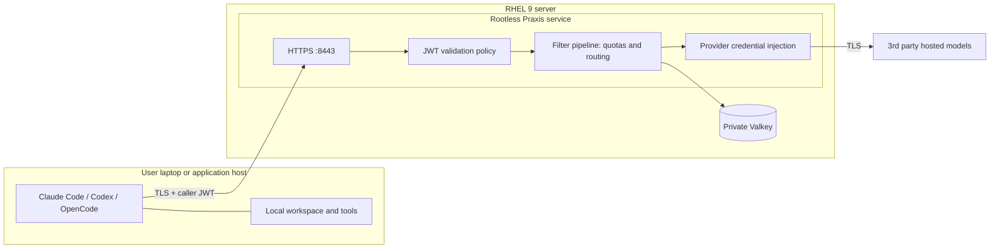

# Remote HTTPS/JWT gateway

Harnesses run on users' own machines. RHEL runs Praxis and, for persistent
token quotas, one private Valkey container. No user SSH account is required
on the gateway. Follow [installation](install.md), then [user setup](users.md).

## Trust model

| Boundary | Control |
| --- | --- |
| Public inference | Only TLS port 8443; valid signature, issuer, audience and expiry required |
| Network access | Administrator restricts SSH and HTTPS source IPs; no plaintext fallback |
| Service ownership | Locked `praxis-svc`, root-owned policy/Quadlets, protected provider secrets |
| Signing authority | JWT private key stays on the administrator workstation; Praxis receives the public key only |
| Private endpoints | Admin 9901 and Valkey 6379 are not host-published |
| Harness execution | Files and tools stay on the client; the gateway is not a harness sandbox |

Praxis terminates TLS itself. The installer uses rootless Podman/Quadlet and
systemd lingering, so the service starts at boot and survives SSH logout.
Using 8443 avoids changing the host's privileged-port policy.

## Current scope

- Native OpenAI Responses/Chat Completions and Anthropic Messages passthrough.
  Anthropic exposes only `/v1/messages` and `/v1/messages/count_tokens`.
  Batch APIs are blocked: asynchronous batch work has no qualified quota
  accounting here. Unknown paths are rejected; cross-API translation is off.
- Shared provider/API [token quotas](../common/token-quotas.md), not per-JWT
  or USD budgets. All valid callers can use every configured model/provider.
- Administrator-issued, expiring JWTs; no OIDC login/refresh or immediate
  per-token revocation. Emergency key rotation invalidates all callers.
- Real-harness and RHEL host qualification remain required. Switchyard
  and local vLLM are outside this scenario. For host-local sandbox experiments,
  see [OpenShell + Praxis](../openshell-praxis/README.md).

TLS certificates and JWT verification keys are replaced through a reviewed
same-profile reinstall/restart. Automatic certificate renewal is not supplied.
