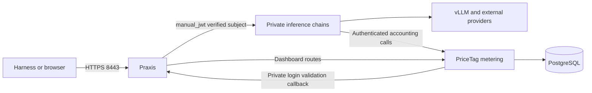

# Remote gateway with PriceTag spending budgets

For a **new cloud-only RHEL VM**, follow [AWS installation](aws-pricetag.md)
from VM creation through provider setup, users, dashboards and OpenCode.
This page covers local Podman testing, adding metering beside an existing
all-in-one installation, and ongoing user/JWT administration.

The deployment adds a JWT-authenticated HTTPS gateway, PriceTag user/admin
dashboards and PostgreSQL. The metered endpoint uses USD
budgets and retains PriceTag’s legacy 10-billion-token monthly safety net.
It has no Praxis `token_rate_limit` filter.



The `manual_jwt` filter runs inside Praxis; there is no extra authentication
service and no metering source change. Inference and login use the same public
key and live credential registry. Caller JWTs have **no automatic expiry**.
Their signature, issuer, audience, subject, issue time and registry membership
are verified. If a credential includes `exp` or `nbf`, those claims are enforced.

The callback listens on private container port 18084. Publish only HTTPS 8443;
never publish 18084 or the metering/database ports. The public gateway rejects
`/validate`. Metering calls `MAAS_VALIDATE_URL=http://pricetag-gateway:18084/validate`
and creates its existing seven-day Secure/HttpOnly/SameSite browser cookie.
Other inference, accounting and dashboard-boundary listeners use container
loopback. The dashboard boundary strips caller-supplied identity headers and
requires an allowed Origin on writes and login.

## Build the images and test locally

A public metering image has not been verified. The upstream manifest names
`ghcr.io/redhat-et/pricetag-metering:latest`, but its image provenance document
identifies the deployed artifact as internal to OpenShift. Build the pinned,
unmodified upstream source with this repository's packaging helper:

```console
git clone https://github.com/redhat-et/pricetag-metering.git ../pricetag-metering
python3 scripts/pricetag/build-metering --source ../pricetag-metering
```

The helper builds source commit `557ceb1cbe1316d93e0f682baa8301455956fe18` from
`git archive`, so local checkout edits and secrets do not enter the build. Its
Containerfile pins builder/runtime digests and targets the build host architecture.
Use `--platform linux/amd64` for an image to transfer to an x86 RHEL host; building
natively on RHEL is faster than emulation. Local ARM and RHEL AMD64 builds have
different image IDs even when they use the same source.

Build the reviewed experimental checkout containing `manual_jwt`:

```console
podman build --build-arg FEATURES=otel -t localhost/praxis-experimental:manual-jwt \
  -f ../experimental/Containerfile ../experimental
python3 scripts/pricetag/local up
python3 -B tests/pricetag/local.py
```

Replace `../experimental` with the reviewed experimental repository path. After release,
use the published image digest only after confirming it includes `manual_jwt`.
The experimental repository publishes to GHCR; the Quay image also depends on
its downstream build completing. Set `PRAXIS_IMAGE` and `METERING_IMAGE` before
initialization to select other reviewed image references.

Open **https://localhost:8443/login**. The local deployment publishes only Mac
loopback. It uses a synthetic provider and deliberately inflated test prices;
no cloud credentials are needed. Trust `.state/pricetag/tls/ca.pem` for this
local test in your browser, or use the browser's certificate exception for
localhost. Do not disable certificate verification in a real harness setup.

Paste `.state/pricetag/alice.jwt` for the user dashboard, or
`.state/pricetag/admin.jwt` for the admin dashboard. Tokens are private files;
copy their contents locally, not into chat or a GitHub issue. `/dashboard`
shows usage; `/admin#quotas` opens spending policy and per-person overrides.
The acceptance test creates separate test users and exercises native Chat,
Responses and Messages with JSON and SSE, forged identities, USD denial,
independent users and a live allowance increase.

```console
python3 scripts/pricetag/local status
python3 scripts/pricetag/local down
```

`down` retains the database and credentials. `up` resumes them without resetting
budgets and restarts the gateway to load its rendered configuration. Both application
image IDs are recorded at initialization in
`.state/pricetag/deployment.json`; rebuilding a tag alone does not upgrade
running services. Image upgrades require reviewing the IDs and recreating the
application containers with their existing state and database volume.

You can also preview client configuration against this local gateway:

The OpenCode helper loads the full authenticated catalog into the per-process
providers `praxis-openai` and `praxis-messages`, enabling whichever APIs are
advertised. `--model` sets the starting model; `/models` switches between gateway
models in the same session. Relaunch to refresh the catalog after server changes.
Per-provider allowlists exclude inherited local model entries; background tasks
use the starting gateway model through the session's `small_model` setting.
It does not edit the user's persistent OpenCode configuration.
[OpenCode provider configuration](https://opencode.ai/docs/config/#enabled-providers).

```console
python3 scripts/pricetag/harness opencode --url https://localhost:8443 \
  --token-file .state/pricetag/alice.jwt --ca-file .state/pricetag/tls/ca.pem \
  --model demo-model --print-config
```

The synthetic provider is for protocol and spending tests. Use the real vLLM
on RHEL for interactive coding tasks.

## Add metering beside an existing all-in-one RHEL installation

First follow [AWS HTTPS access](aws.md#pricetag-on-an-existing-vm). Only your
workstation's public IPv4 `/32` needs TCP 8443 access. On-host tests use HTTPS
loopback with a caller JWT and do not need the VM's public IP in the allowlist.

Use an existing all-in-one provider configuration with a unified model catalog.
The first pilot needs `/etc/praxis/shared-gateway.yaml` in the installer's JSON
format and `/etc/praxis/unified-models.json`. It needs the locked `praxis-svc`
account, its `praxis.network` Quadlet and its existing provider secret references.
For a fresh cloud-only VM, use [AWS installation](aws-pricetag.md) instead of
this existing-installation path. A separate external vLLM can replace the local model
later without moving the metering database.

From the secure-single-server checkout, copy only the deployment sources:

```console
tar --no-xattrs -czf - scripts/pricetag scripts/common/lib.sh scripts/common/harness.py \
  scripts/common/unified_config.py scripts/remote-gateway/credentials configs/pricetag | \
  ssh -o IdentitiesOnly=yes -o ForwardAgent=no -i "$SSH_KEY" "$RHEL_HOST" \
    'mkdir -p ~/secure-single-server-pricetag && tar -xzf - -C ~/secure-single-server-pricetag'
```

On RHEL, obtain the same pinned metering source and the reviewed experimental
filter branch. Build both images natively in the SSH administrator's Podman
storage, then load them into the locked service account's storage:

```console
cd ~/secure-single-server-pricetag
git clone https://github.com/redhat-et/pricetag-metering.git ~/pricetag-metering
python3 scripts/pricetag/build-metering --source ~/pricetag-metering
podman build --build-arg FEATURES=otel -t localhost/praxis-experimental:manual-jwt \
  -f ~/experimental/Containerfile ~/experimental
PRICETAG_UID=$(id -u praxis-svc)
svc() {
  (cd /tmp && sudo -u praxis-svc env \
    XDG_RUNTIME_DIR="/run/user/$PRICETAG_UID" \
    DBUS_SESSION_BUS_ADDRESS="unix:path=/run/user/$PRICETAG_UID/bus" "$@")
}
set -o pipefail
podman save localhost/pricetag-metering:upstream-557ceb1 | svc podman load
podman save localhost/praxis-experimental:manual-jwt | svc podman load
METERING_IMAGE=$(svc podman image inspect localhost/pricetag-metering:upstream-557ceb1 --format '{{.Id}}')
PRAXIS_IMAGE=$(svc podman image inspect localhost/praxis-experimental:manual-jwt --format '{{.Id}}')
METERING_IMAGE="sha256:${METERING_IMAGE#sha256:}"
PRAXIS_IMAGE="sha256:${PRAXIS_IMAGE#sha256:}"
```

`~/experimental` must contain the reviewed filter implementation. Alternatively,
transfer an already built **linux/amd64** image with `podman save`, then load it
on RHEL; no registry publication is required. Do not transfer the Mac's ARM image.

Review the initial pricing sources. Every gateway alias receives a separate
snapshot of its source model's rates; a missing source price stops bootstrap
before the HTTPS gateway starts. For the local quantized Qwen pilot, this example
uses PriceTag's existing 27B reference rates as an internal chargeback rate.
That rate is not an AWS infrastructure cost or a provider invoice. All other
aliases default to their configured upstream model's PriceTag catalog entry.

```console
cat > ~/pricetag-price-sources.json <<'JSON'
{"vllm/qwen3.8-27b-int4": "Qwen3.8-27B-FP8"}
JSON
GATEWAY_HOST='YOUR_VM_PUBLIC_IP_OR_DNS_NAME'
cd ~/secure-single-server-pricetag
sudo python3 scripts/pricetag/prepare.py \
  --hostname "$GATEWAY_HOST" \
  --metering-image "$METERING_IMAGE" --praxis-image "$PRAXIS_IMAGE" \
  --provider-unit "/etc/containers/systemd/users/$PRICETAG_UID/praxis.container" \
  --price-sources "$HOME/pricetag-price-sources.json" \
  --monthly-usd 5
```

Preparation writes configuration and separate Quadlets in `/etc/praxis-pricetag`.
Add `--vllm-only` to exclude cloud models, routes and provider secret mounts
without deleting credentials from the original installation. Only secrets
needed by the rendered gateway are mounted. Use
[the fresh cloud-only guide](aws-pricetag.md) and `--mock-provider` for a
separate performance VM without an existing provider installation.
It creates the issuer, a private test CA, and initial `admin`, `alice` and `bob`
JWTs under `/root/pricetag-admin`, without an `exp` claim. Their active digests
live in `/etc/praxis-pricetag/gateway/users.json`. It refuses existing
directories so it cannot silently rotate keys or replace a deployment.
The public key and server TLS key go to containers; the JWT signing key and CA
signing key stay with the administrator. Review the generated
`quadlets/`, `models.json`, `price-sources.json` and `bootstrap.sql` before starting.
Environment files contain secrets and must remain private.

```console
sudo scripts/pricetag/start
svc systemctl --user status pricetag-db pricetag-metering pricetag-gateway --no-pager
```

Startup applies SELinux labels, starts PostgreSQL and metering, waits for
readiness, and initializes the fresh database before starting the gateway. Login becomes
available when the gateway’s private callback is listening. It
creates the unique event-ID index, enables monthly USD enforcement without
post-cap exceptions, and snapshots alias prices. Subsequent starts preserve
the existing policy. It refuses to bootstrap a database that already has usage.
Existing databases require PriceTag's separate event-idempotency migration.

## Test JWT access on the VM and from your laptop

Provision Alice before exporting her caller token. If the AWS guide already
provisioned her, skip this block and use its `alice-ready.jwt`:

```console
cd ~/secure-single-server-pricetag
sudo python3 scripts/pricetag/user --subject alice --name Alice --rotate \
  --monthly-usd 5 --output /root/pricetag-admin/alice-ready.jwt
```

On RHEL, use HTTPS loopback with the CA and an ordinary user's JWT. The test
certificate includes localhost and the configured public host. As the SSH
administrator, export only a user token and the public CA certificate into
your own private client directory:

```console
install -d -m 0700 "$HOME/.config/praxis-pricetag"
sudo install -m 0600 -o "$(id -u)" -g "$(id -g)" \
  /root/pricetag-admin/alice-ready.jwt "$HOME/.config/praxis-pricetag/caller.jwt"
sudo install -m 0600 -o "$(id -u)" -g "$(id -g)" \
  /etc/praxis-pricetag/ca.pem "$HOME/.config/praxis-pricetag/ca.pem"
cd ~/secure-single-server-pricetag
python3 scripts/pricetag/harness opencode --url https://localhost:8443 \
  --token-file "$HOME/.config/praxis-pricetag/caller.jwt" \
  --ca-file "$HOME/.config/praxis-pricetag/ca.pem" --model vllm/qwen3.8-27b-int4
```

The harness must already be installed for the SSH account. Use an ordinary
user for budget tests: super-admins are exempt from spending limits. The
launcher first fetches `/v1/models` using that JWT; loopback has the same
authentication requirement as the public endpoint. Add `--print-config` to
inspect a redacted configuration without launching the harness.

On your laptop, copy those two exported client files through SSH, then run the
launcher from this checkout with the public hostname:

```console
install -d -m 0700 "$HOME/.config/praxis-pricetag"
scp -o IdentitiesOnly=yes -o ForwardAgent=no -i "$SSH_KEY" \
  "$RHEL_HOST:.config/praxis-pricetag/caller.jwt" \
  "$RHEL_HOST:.config/praxis-pricetag/ca.pem" "$HOME/.config/praxis-pricetag/"
chmod 0600 "$HOME/.config/praxis-pricetag/caller.jwt"
python3 scripts/pricetag/harness opencode \
  --url https://YOUR_VM_PUBLIC_IP_OR_DNS_NAME:8443 \
  --token-file "$HOME/.config/praxis-pricetag/caller.jwt" \
  --ca-file "$HOME/.config/praxis-pricetag/ca.pem" --model vllm/qwen3.8-27b-int4
```

Never copy issuer or service private keys to clients. Trust the CA in your
browser and paste the same caller JWT at
`https://YOUR_VM_PUBLIC_IP_OR_DNS_NAME:8443/login`. That origin must match the
public host configured during preparation. For admin access, export and
transfer `admin.jwt` separately with the same private-file procedure; use it
only for administration.

<details>
<summary>What the harness launcher configures, and file-based alternatives</summary>

This deployment's launcher is `scripts/pricetag/harness`. It reads the
authenticated gateway catalog and uses the selected alias's native API,
context window and output allowance. Pass the HTTPS origin without `/v1`.
The model argument is the complete gateway alias, such as
`vllm/qwen3.8-27b-int4` or `openai/gpt-5.4-mini`.

| Harness argument | Configuration supplied at launch | Persistent alternative |
| --- | --- | --- |
| `opencode` | `OPENCODE_CONFIG_CONTENT`: full catalog grouped into `praxis-openai` and `praxis-messages`, caller JWT and per-model limits. GPT-5/GPT-6/o1/o3/o4 use the OpenAI Responses SDK; other OpenAI models use Chat Completions; Messages models use the Anthropic SDK. `--api anthropic` selects the starting dialect for a dual-API model | Put the provider/model blocks in `opencode.json` and load the JWT from a private environment variable |
| `codex` | Command-line provider settings using `/v1/responses`, caller JWT environment variable and context/compaction limits. Local vLLM gets a generated model catalog under `~/.cache/pricetag-harness` | Put the equivalent provider/model settings in `~/.codex/config.toml`, keeping credentials in the environment |
| `claude-code` | `ANTHROPIC_BASE_URL`, `ANTHROPIC_AUTH_TOKEN`, explicit model/context/output settings; local Qwen gets the existing custom-menu settings and compatible reasoning effort | Export the same environment settings before launching `claude`; keep the token in a private file |

Use `--print-config` for the exact settings; token values are redacted.
The helper changes its child process environment and writes only the Codex
model catalog, leaving existing harness settings files intact. The CA is
supplied through each client's TLS environment settings. Local Qwen thinking
remains enabled by the vLLM configuration; this helper does not turn it off.

This is catalog-driven launch configuration. Native model discovery inside
Claude's `/model` menu remains disabled for this pilot; it is not established
by successfully fetching `/v1/models`. Codex needs a Responses-capable model,
Claude needs a Messages-capable model, and OpenCode can use either. The helper
rejects combinations that require API translation the gateway does not provide.

</details>

## Administrator scripts: provision, rotate and revoke

### 1. Connect from your workstation

```console
SSH_KEY='/absolute/path/to/your/ssh-key'
RHEL_HOST='ec2-user@YOUR_GATEWAY_IP'
ssh -o IdentitiesOnly=yes -o ForwardAgent=no -i "$SSH_KEY" "$RHEL_HOST"
```

### 2. Provision the initial caller — RHEL

Run after gateway startup if Alice has not already been provisioned by the
installation guide. Preparation issued her initial token; `--rotate` replaces it
and links her person and $5 monthly allowance. For an existing provisioned user,
use the rotation or allowance instructions below instead.

```console
cd ~/secure-single-server-pricetag
sudo python3 scripts/pricetag/user --subject alice --name Alice --rotate \
  --monthly-usd 5 --output /root/pricetag-admin/alice-ready.jwt
```

### 3. Add a new user — RHEL

```console
sudo python3 scripts/pricetag/user --subject charlie --name Charlie \
  --monthly-usd 10 --output /root/pricetag-admin/charlie-v1.jwt
```

### 4. Copy a caller key — workstation

Use your selected host/key variables from step 1. Stop on a failed copy.

```console
CLIENT_DIR="$HOME/.config/praxis-pricetag/YOUR_GATEWAY_NAME"
install -d -m 0700 "$CLIENT_DIR"
umask 077
ssh -o IdentitiesOnly=yes -o ForwardAgent=no -i "$SSH_KEY" "$RHEL_HOST" \
  'sudo -n cat /etc/praxis-pricetag/ca.pem' > "$CLIENT_DIR/ca-next.pem" &&
  mv "$CLIENT_DIR/ca-next.pem" "$CLIENT_DIR/ca.pem"
ssh -o IdentitiesOnly=yes -o ForwardAgent=no -i "$SSH_KEY" "$RHEL_HOST" \
  'sudo -n cat /root/pricetag-admin/alice-ready.jwt' > "$CLIENT_DIR/caller-next.jwt" &&
  mv "$CLIENT_DIR/caller-next.jwt" "$CLIENT_DIR/caller.jwt"
chmod 0600 "$CLIENT_DIR/caller.jwt"
```

Use `caller.jwt` with the harness helper or dashboard login. Signing keys stay
on the server; admin JWTs are only for administration.

### 5. Rotate a caller key — RHEL

```console
sudo python3 scripts/pricetag/credentials rotate --subject alice \
  --output /root/pricetag-admin/alice-v2.jwt
```

Identity, allowance and spending history remain unchanged. On your workstation:

```console
umask 077
ssh -o IdentitiesOnly=yes -o ForwardAgent=no -i "$SSH_KEY" "$RHEL_HOST" \
  'sudo -n cat /root/pricetag-admin/alice-v2.jwt' > "$CLIENT_DIR/caller-next.jwt" &&
  mv "$CLIENT_DIR/caller-next.jwt" "$CLIENT_DIR/caller.jwt"
```

Restart the harness. The old token stops working for subsequent authentication;
in-flight inference can finish.

### 6. Revoke or list keys — RHEL

```console
sudo python3 scripts/pricetag/credentials revoke --subject alice
sudo python3 scripts/pricetag/credentials list
```

To restore a revoked user, run `rotate` with a new output filename. `issue`
refuses existing subjects. Output files are private and never overwritten.

### 7. Rotate the admin key — RHEL

```console
sudo python3 scripts/pricetag/credentials rotate --subject admin \
  --output /root/pricetag-admin/admin-v2.jwt &&
sudo install -m 0600 -o root -g root \
  /root/pricetag-admin/admin-v2.jwt /root/pricetag-admin/admin.jwt
```

Update any private workstation copy afterward. `scripts/pricetag/user` reads
the canonical `admin.jwt` path. Use a fresh filename for every later rotation.

### 8. Change a USD allowance

Log in with the admin JWT and open `/admin#quotas`. Change the person's monthly
USD override there; no token rotation or gateway restart is required.

### Browser sessions

JWTs have no automatic expiry. Revocation/rotation blocks new inference and
new logins, but existing dashboard cookies can survive for seven days. Immediate
per-user browser-session revocation is unavailable with unmodified metering.
Rotating `SESSION_SECRET` invalidates all browser sessions; restart metering and
then run `sudo scripts/pricetag/start` to restore its dependent gateway too.

### Local Podman paths

```console
python3 scripts/pricetag/credentials rotate --subject alice \
  --registry .state/pricetag/gateway/users.json --key .state/pricetag/issuer/private.pem \
  --output .state/pricetag/alice-v2.jwt
```

The registry uses locked atomic updates. Keep its directory administrator-owned
and mount the directory read-only into the gateway. Missing/corrupt registry
state fails closed with 503; invalid/revoked credentials return 401.

## Replace a running gateway's PriceTag endpoint or key

For deployments created with `scripts/pricetag/providers`, SSH to the gateway
host and run:

```console
cd ~/secure-single-server-pricetag
sudo python3 scripts/pricetag/providers pricetag --replace --debug
```

Enter the new hostname once, review both credential destinations, then enter
the key at the hidden prompt. For a deployment initialized with a different
provider-input directory, add `--state-dir /root/YOUR_PROVIDER_INPUT_DIRECTORY`.
That directory must retain the original provider configuration and secret
references and be root-owned with private permissions.

The command preserves installed models and limits, direct OpenAI, JWTs,
allowances, pricing and spending history. It creates a new Podman secret and
restarts only Praxis; expect a brief inference/dashboard interruption. It
backs up affected files privately and rolls back if activation fails. If
recovery also fails, the error reports the backup directory and manifest.
Old secrets remain available for rollback. Do not run `prepare` afterward.

For direct OpenAI key replacement, use:

```console
sudo python3 scripts/pricetag/providers openai --replace --debug
```

This keeps the direct OpenAI endpoint and existing catalog; the PriceTag
provider remains unchanged.

Discovery must confirm the installed models and their configured limits, or
you must explicitly pin confirmed catalog omissions using the
[discovery options](aws-pricetag.md). A pin does not prove inference access.
Plain replacement refuses new models, lower served limits or missing unpinned models.
After success, test an actual request on each configured upstream API. The
activation check verifies gateway HTTPS and authentication, not upstream inference.

### Refresh PriceTag models when migrating providers

To replace its model catalog with advertised presets plus explicit pins, use:

```console
sudo python3 scripts/pricetag/providers pricetag --replace --refresh-models --debug \
  --pin-model anthropic:rits/zai-org/glm-5-3
```

This can remove PriceTag models omitted by the new catalog. Pin other documented,
confirmed models explicitly if discovery omits them. Direct OpenAI models remain
configured. The command prints additions/removals and updates native routes,
the authenticated catalog and price-source mappings together. It refuses native
gateway edits that do not match saved provider inputs.

Missing alias prices are copied from the existing metering price source in a
transaction before activation. Missing sources or historical unpriced usage stop
the update. Existing price rows, retired-model usage, identities and budgets are
never reset. Newly inserted alias prices remain if configuration rolls back.
GLM's upstream seed is zero-priced; review that chargeback policy before enabling
it. Relaunch clients after a catalog change. Its context/output caps are
262144/65536 and its OpenCode configuration is text-only; avoid image history.

### Diagnose PriceTag authentication or catalog omissions

Each command prompts for the host and key without saving the key or changing
provider configuration. Catalog checks try both credential headers:

```console
sudo python3 scripts/pricetag/providers pricetag --check-auth --debug
```

For a reviewed model that is missing from discovery, test its actual inference
route. This makes a small request with a 16-token output cap and can incur usage:

```console
sudo python3 scripts/pricetag/providers pricetag \
  --check-inference openai:gpt-6-luna --debug
```

Use `anthropic:rits/zai-org/glm-5-3` to test the GLM Messages route instead.
The diagnostic retries the alternate header only after 401/403 and prints no
credential values or response bodies. It does not establish streaming or tool
support. If both headers fail, verify credential issuance, endpoint and access;
do not bypass authentication errors with a model pin.

## Boundaries and operation

- USD allowances are the primary budget. `MONTHLY_TOKEN_QUOTA=10000000000`
  retains the upstream monthly token safety net, so exhausting either limit
  can deny a request. Token counts also remain necessary for pricing.
- USD enforcement uses recorded spending and PriceTag's current decision cache
  (up to 15 seconds). In-flight requests can overshoot a limit. It is not a
  prepaid reservation mechanism. Admin override changes invalidate that cache.
- Metering unavailability rejects new requests with 503. Usage delivery after a
  response is asynchronous; delivery failure can undercount and needs monitoring.
- The pinned Praxis filter's 429 text still says `token budget exhausted`.
  The decision combines USD spending with the retained legacy safety net. The dashboard shows
  the USD allowance; correcting the filter's denial wording is still required.
- Model aliases have separate initial rate snapshots. Avoid changing those rows
  during the pilot: the current quota query reprices historical usage. Review
  pricing changes and historical-ledger behavior before production use.
- Kubernetes routing, MaaS key management and impersonation are outside this
  standalone pilot. Their routes are not exposed through the gateway.
- Back up with `svc podman exec pricetag-db pg_dump -U metering -d metering -Fc`
  into an administrator-only file. Keep encrypted backups of the issuer, TLS,
  session/M2M configuration and database together. Rehearse restoration to a
  separate database before relying on recovery.

To roll back the pilot, stop `pricetag-gateway`, `pricetag-metering` and
`pricetag-db` user services. Keep the named volume and configuration for recovery.
The original all-in-one services and model weights remain available. Remove the
8443 security-group rule and matching journal entry if abandoning remote access.
Do not run the original shared-gateway quota helper against this USD policy.

For broader client access later, follow
[the public HTTPS transition](pricetag-access.md).
Retain JWT/TLS, private accounting/database ports and restricted SSH. The admin
dashboard shares port 8443 with inference: opening that port also makes its login
and routes publicly reachable, with authentication and role checks still enforced.
If admin access must remain IP-restricted, first add a separate application or
listener boundary. The AWS guide includes the access tradeoff and rollback steps.
